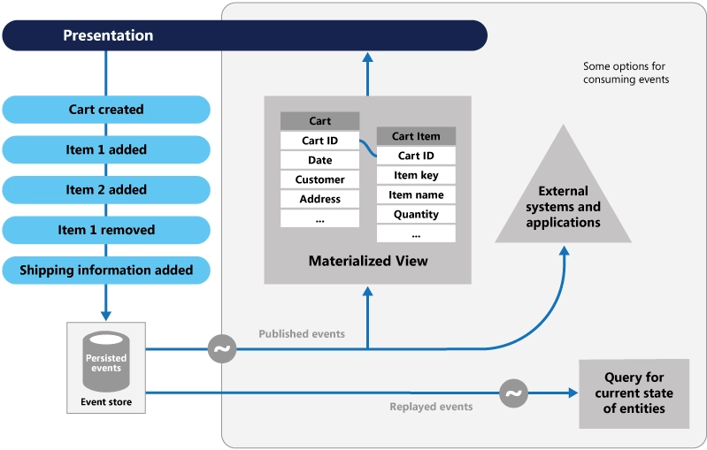

# Inventory Event Sourcing

This repository demonstrates an event sourcing implementation using Marten with Postgres for managing Inventory, Warehouse, Order, and Cart functionalities. Event sourcing captures all changes to application state as a sequence of events, providing detailed auditing, reconstruction of past states, and a clear history of data changes.

## Features

- **Event Sourcing:** Utilizes Marten with Postgres to implement event sourcing for Inventory, Warehouse, Order, and Cart management.
- **Services Implemented:**
  - CartService: Manages shopping cart operations such as adding/removing items, updating quantities, and shipping information.
  - OrderService: Handles order creation, cancellation, submission, and retrieval.
  - InventoryService: Provides operations for managing inventory like adding/removing products, updating product information, and retrieving product details.
  - ProductTransactionService: Manages product transactions including sales, purchases, and transfers between warehouses.
  - WarehouseService: Retrieves information about warehouses and their products.

## Cart Endpoints

- **GET /cart/{userId}**
  - Retrieves the cart items for a specific user.

- **POST /cart/add/{userId}/{productId}/{quantity}**
  - Adds a product to the user's cart with the specified quantity.

- **PUT /cart/update/{userId}/{productId}/{quantity}**
  - Updates the quantity of a product in the user's cart.

- **DELETE /cart/remove/{userId}/{productId}**
  - Removes a product from the user's cart.

- **DELETE /cart/clear/{userId}**
  - Clears all items from the user's cart.

## Order Endpoints

- **POST /order/create/{userId}**
  - Creates a new order.

- **DELETE /order/cancel/{userId}/{orderId}**
  - Cancels an order.

- **GET /order/{userId}**
  - Retrieves orders for a user.

- **POST /order/submit/{userId}**
  - Submits an order.

## Inventory Endpoints

- **POST /inventory/add/{name}/{warehouseId}**
  - Adds a new product to inventory.

- **GET /inventory/product/{productId}/{warehouseId}**
  - Retrieves product details including quantity and transactions.

- **DELETE /inventory/remove/{productId}/{warehouseId}**
  - Removes a product from inventory.

- **PUT /inventory/update/{productId}/{name}/{warehouseId}**
  - Updates product information.

- **POST /inventory/sale/add/{warehouseId}/{productId}/{quantity}/{price}**
  - Adds a sale transaction for a product.

- **POST /inventory/purchase/add/{warehouseId}/{productId}/{quantity}/{price}**
  - Adds a purchase transaction for a product.

- **POST /inventory/transfer/{sourceWarehouseId}/{targetWarehouseId}/{productId}/{quantity}**
  - Transfers a product between warehouses.

- **GET /warehouses**
  - Retrieves all warehouses.

## Marten with Postgres

### Marten

[Marten](https://github.com/JasperFx/marten) is a library for .NET applications that combines the benefits of event sourcing and document databases. It provides:

- **Event Store:** Marten uses Postgres as an event store, storing all domain events that occur within the application. Each event represents a change to the application's state.
  
- **Document Database:** Postgres, as the underlying database, not only stores event streams efficiently but also supports complex querying capabilities needed for reconstructing application state from events.

- **Event Handlers:** Marten allows you to define event handlers that react to domain events by updating read models or external systems. This facilitates real-time updates and projections based on changes in the event store.

### Why Postgres with Marten?

Using Postgres with Marten offers several advantages:

- **Scalability:** Postgres is known for its scalability and reliability, making it suitable for applications that require handling large volumes of data and high transaction rates, such as inventory management.

- **Rich Querying:** Postgres provides powerful SQL querying capabilities, which Marten leverages for efficiently querying event streams and reconstructing application state.

- **ACID Compliance:** Postgres ensures ACID (Atomicity, Consistency, Isolation, Durability) compliance, ensuring data integrity and reliability even in the face of concurrent operations and failures.

- **Community and Ecosystem:** Postgres has a large and active community, along with extensive ecosystem support, including tools for monitoring, replication, and management, which are beneficial for enterprise-grade applications.

## Setup Instructions

To run the project locally:

1. Clone this repository.
2. Set up a Postgres database and configure connection details in `appsettings.json`.
3. Restore NuGet packages and build the solution.
4. Run the application.

### API Documentation

Explore and test the API using the Swagger UI available at `{base_url}/swagger`.

### Contributing

Contributions are welcome! Please fork the repository and submit pull requests for any enhancements or bug fixes.

### License

This project is licensed under the MIT License - see the [LICENSE](LICENSE) file for details.
